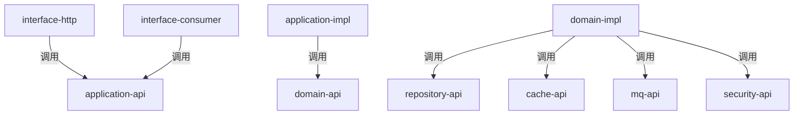
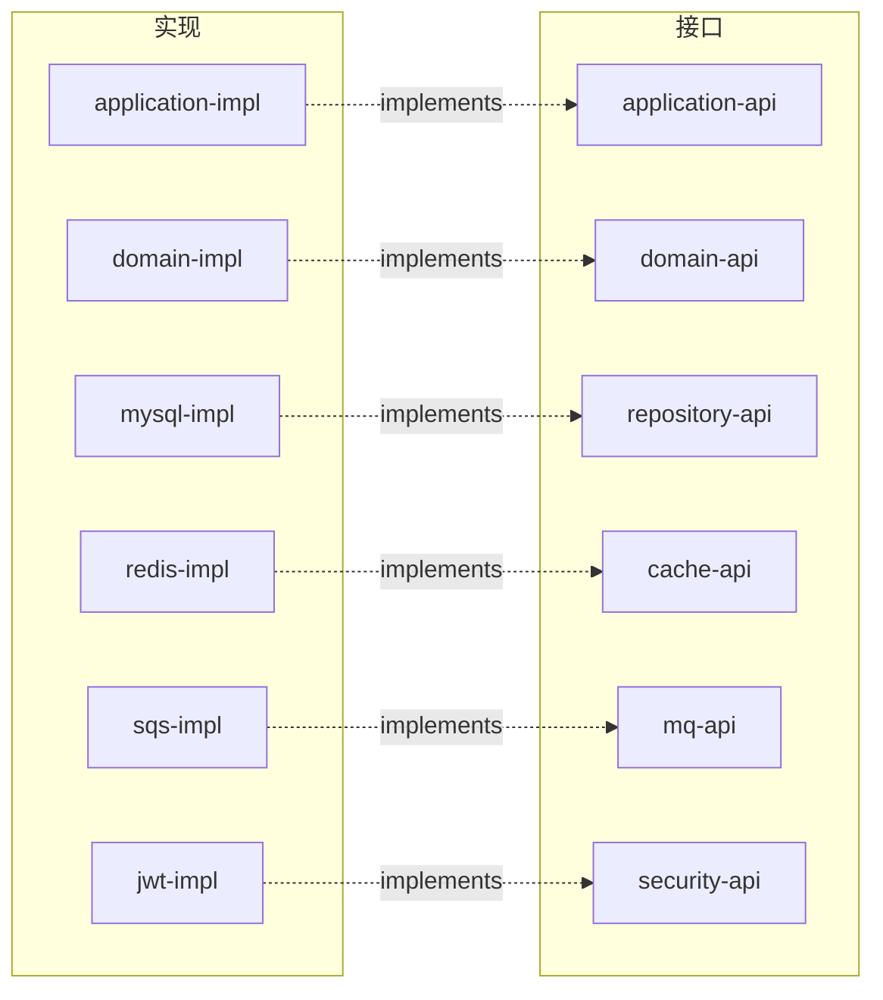
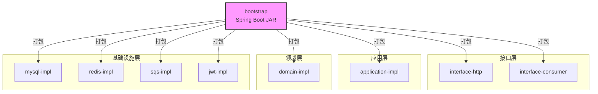

# Awsome Shop Gateway Service

基于领域驱动设计（DDD）+ 六边形架构的商品服务。

- **Java 21** / **Spring Boot 3.4.1** / **MyBatis-Plus 3.5.7**
- 多模块 Maven 项目，26 个子模块
- Flyway 数据库迁移 / Redis 缓存 / SQS 消息队列 / JWT 安全

---

## 模块结构

```
shop-gateway-service/
├── common/                          # 公共基础（异常、错误码、Result）
├── domain/
│   ├── domain-model/                # 领域实体
│   ├── domain-api/                  # 领域服务接口
│   ├── domain-impl/                 # 领域服务实现
│   ├── repository-api/              # 仓储接口（Port）
│   ├── cache-api/                   # 缓存接口（Port）
│   ├── mq-api/                      # 消息队列接口（Port）
│   └── security-api/                # 安全接口（Port）
├── infrastructure/
│   ├── repository/mysql-impl/       # 仓储实现（Adapter）
│   ├── cache/redis-impl/            # 缓存实现（Adapter）
│   ├── mq/sqs-impl/                 # 消息队列实现（Adapter）
│   └── security/jwt-impl/           # 安全实现（Adapter）
├── application/
│   ├── application-api/             # 应用服务接口 + DTO
│   └── application-impl/            # 应用服务实现
├── interface/
│   ├── interface-http/              # HTTP 控制器
│   └── interface-consumer/          # 消息消费者
└── bootstrap/                       # Spring Boot 启动 + 配置
```

---

## 模块依赖关系图


### 一、调用依赖（接口调用方向）

> 表示运行时的方法调用关系，箭头方向为"调用 → 被调用"。



### 二、实现依赖（接口实现关系）

> 表示接口 ↔ 实现的关系，箭头方向为"实现类 → 接口"。



### 三、打包依赖（Maven 模块聚合）

> bootstrap 模块负责最终打包，汇聚所有模块为一个可运行的 Spring Boot JAR。



---

## DDD 分层原则

| 原则 | 说明 |
|------|------|
| **Interface → Application** | 控制器只调用 Application Service 接口 |
| **Application → Domain** | 应用服务只调用 Domain Service 接口，**不直接依赖 Repository** |
| **Domain → Port** | 领域服务通过 Port 接口（repository-api 等）访问基础设施 |
| **Infrastructure → Port** | 基础设施模块实现 Port 接口，依赖反转 |
| **Bootstrap 组装** | 启动模块汇聚所有实现，由 Spring 完成依赖注入 |

---

## 快速开始

```bash
# 1. 启动 MySQL
docker run -d --name mysql-8.4.8 -p 3307:3306 \
  -e MYSQL_ROOT_PASSWORD=root mysql:8.4.8

# 2. 创建数据库
docker exec mysql-8.4.8 mysql -uroot -proot \
  -e "CREATE DATABASE awsome_shop_gateway DEFAULT CHARACTER SET utf8mb4;"

# 3. 编译 & 安装
mvn clean install -DskipTests

# 4. 启动应用
mvn spring-boot:run -pl bootstrap

# 5. 访问 Swagger
open http://localhost:8081/swagger-ui.html
```

---

## 技术栈

| 技术 | 版本 | 用途 |
|------|------|------|
| Java | 21 | 运行时 |
| Spring Boot | 3.4.1 | 应用框架 |
| MyBatis-Plus | 3.5.7 | ORM |
| Flyway | - | 数据库迁移 |
| SpringDoc | 2.7.0 | API 文档 |
| Redis | - | 缓存 |
| AWS SQS | - | 消息队列 |
| Lombok | - | 代码简化 |
